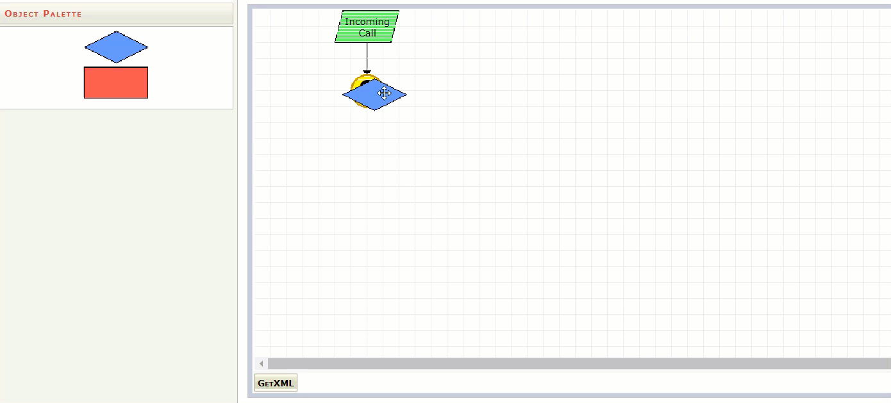

# TollFree-Routset-Builder
**Graphic library for building VISIO like interface for creating Tollfree call Routing**.

## Features includes
1) Multiple Decision Type pick list
2) Destination pick list
3) Drag drop "Decision/Destionation" object into canvas
4) Delete "Decision/Destionation" feature with context menu
5) Generate XML from drawing canvas, so it can be persisted
6) Populate Tollfree Routing tree from XML.
7) Graphics build with Yahoo toolkit

